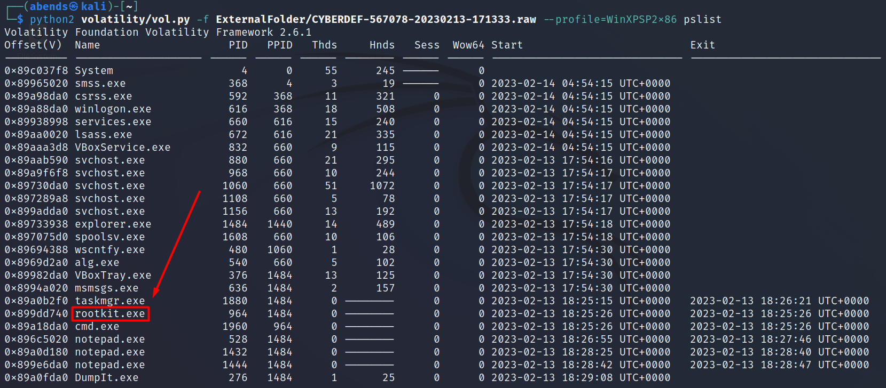

## Cyberdefenders: BlackEnergy Blue Team Lab

**Category**: Memory, Volatility, Windows, T1093.004, T1055.001

---
## [0x01] Scenario

A multinational corporation has been hit by a cyber attack that has led to the theft of sensitive data. The attack was carried out using a variant of the BlackEnergy v2 malware that has never been seen before. The company's security team has acquired a memory dump of the infected machine, and they want you, as a soc analyst, to analyze the dump to understand the attack scope and impact.

---
## [0x02] Tools

- Volatility2

---
## [0x03] Write-Up

---
**Question 1**: Which volatility profile would be best for this machine?

Для того, чтобы просканировать образ RAM для определения профиля операционной системы, необходимо воспользоваться плагином `imageinfo`:

**Answer 1**: `WinXPSP2x86`

---
**Question 2**: How many processes were running when the image was acquired?

Запущенные процессы во время снятия дампа памяти можно просмотреть, указав найденный профиль с помощью опции `--profile` и плагина `pslist`

**Answer 2**: `19`

---
**Question 3**: What is the process ID of cmd.exe?

PID процесса `cmd.exe` можно посмотреть несколькими способами - например, через `psscan` или `pslist`

>Забегая вперед, запомним PID процессе `svchost.exe` => `880`

**Answer 3**: `1960`

---
**Question 4**: What is the name of the most suspicious process?

Среди запущенных процессов вызывает подозрение процесс `0x899dd740 rootkit.exe`

>`rootkit` => это тип вредоносных программ, предназначенных для предоставления злоумышленникам доступа к целевому устройству и контроля над ним.

**Answer 4**: `rootkit.exe`

---
**Question 5**: Which process shows the highest likelihood of code injection?

Из списка процессов необходимо выбрать наиболее подходящий для внедрения кода. svchost.exe является основным процессом для загрузки служб ОС Windows, которые хранятся в `DLL`. Все службы, список которых можно посмотреть в `services.msc`, запускаюстя с помощью `svchost.exe`. Это один из неплохих вариантов для внедрения злоумышленником вредоносного исполняемого кода.

**Answer 5**: `svchost.exe`

---
**Question 6**: There is an odd file referenced in the recent process. Provide the full path of that file.

Для ответа на этот вопрос необходимо узнать путь к файлу, на который ссылается процесс svchost.exe. Для этого мы определяем, что анализируем процесс с PID 880. Для отображения открытых хендлов используем плагин **handles** и укажем тип — файлы.

**Answer 6**: `C:\WINDOWS\system32\drivers\str.sys`

---
**Question 7**: What is the name of the injected dll file loaded from the recent process?

Распространенной практикой среди разработчиков вредоносных программ является попытка скрыть деятельность вредоносной программы, именно этот принцип и позволит определить нам зараженную библиотеку. 

Одним из методов является попытка скрыть DLL‑файлы, связанные с вредоносным кодом. Этого можно добиться путем отвязки подозрительной DLL от **ProcessEnvironmentBlock** (PEB). Таким образом можно обеспечить сокрытие вредоносной деятельности, но все еще остаются следы существования DLL, содержащиеся в **VirtualAddressDescriptor** (VAD). 

VAD — это механизм, идентифицирующий базовый адрес и полный путь DLL‑файла. Плагин ldrmodules сравнивает список процессов и определяет, находятся ли они в PEB. Анализ столбцов InLoad, InInit, InMem позволяют выявить «странную» библиотеку‑ответ msxml3r.dll.

**Answer 7**: `msxml3r.dll`

---
**Question 8**: What is the base address of the injected dll?

Для ответа на последний вопрос необходимо определить базовый адресс зараженной библиотеки. Для этого воспользуемся плагином **malfind**. malfind помогает найти скрытый или внедренный код/DLL в памяти пользовательского режима с помощью VAD. Цель malfind — найти DLL, которые не видят стандартные методы/инструменты, это можно проверить используя плагин **dlllist**, при использовании которого мы не встретим зараженную DLL.

**Answer 8**: `0x980000`

---