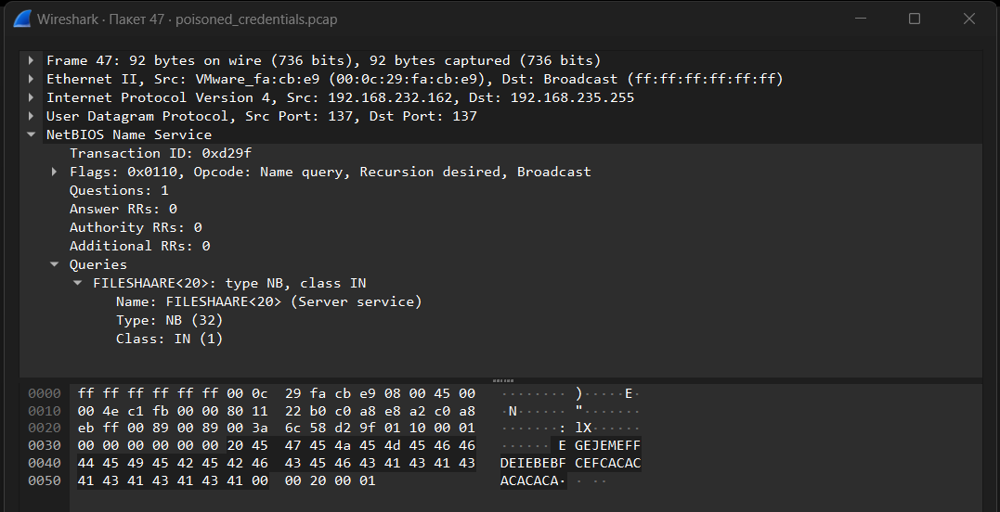
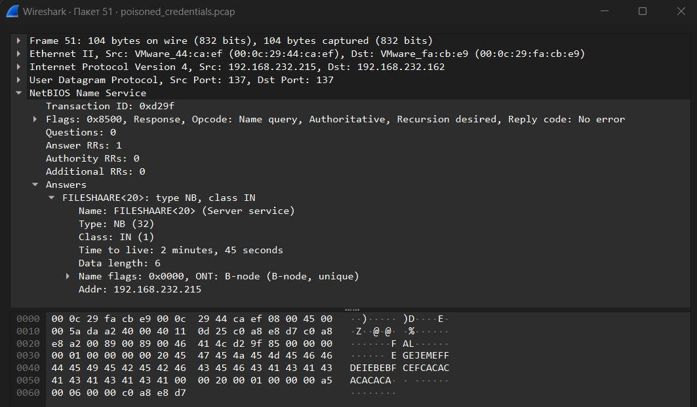
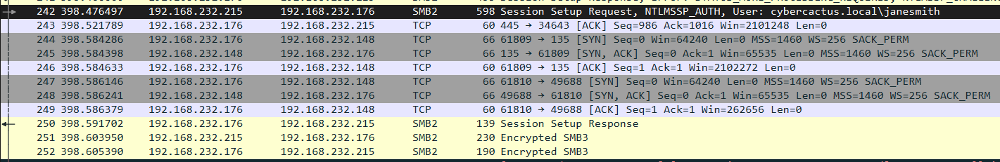
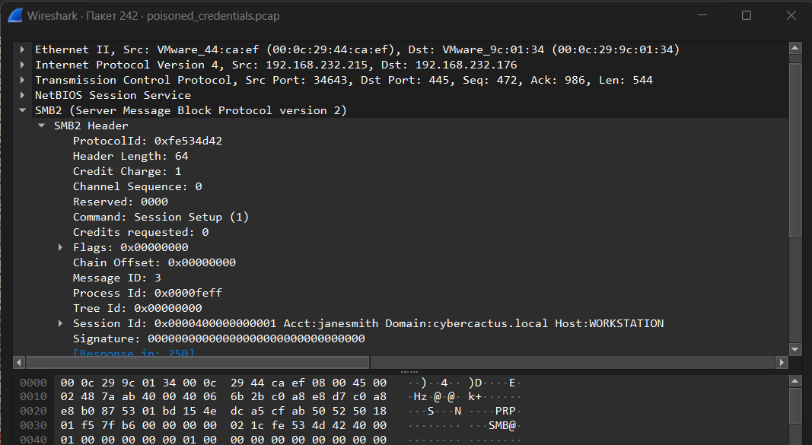
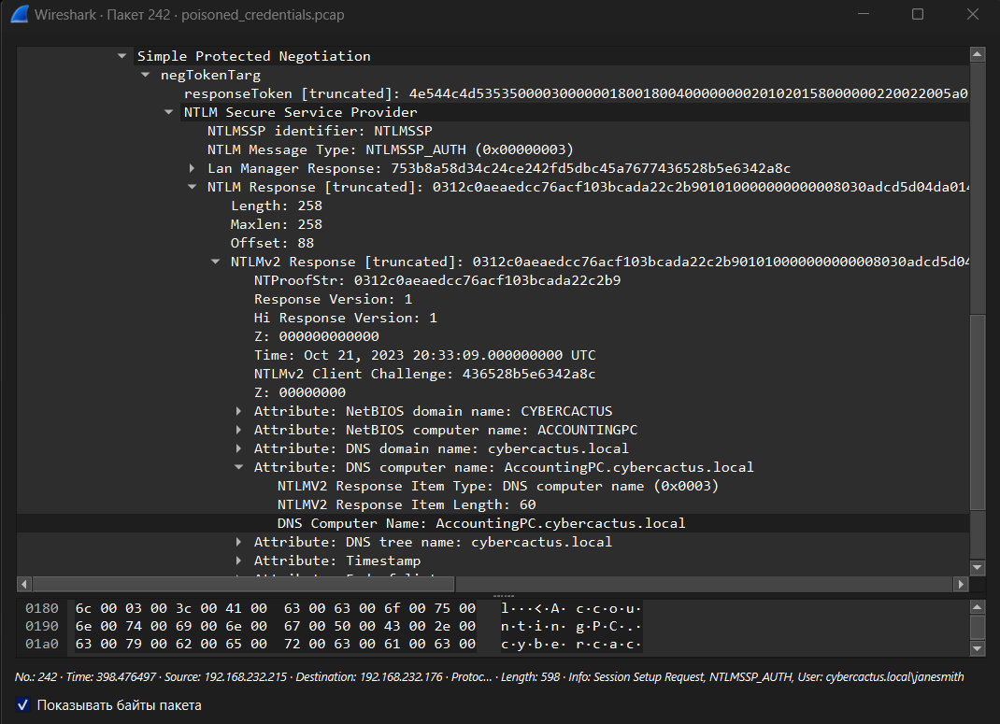

## Cyberdefenders: PoisonedCredentials Blue Team Lab

**Category**: PCAP, Wireshark, Credentials

---
## [0x01] Scenario

Your organization's security team has detected a surge in suspicious network activity. There are concerns that LLMNR (Link-Local Multicast Name Resolution) and NBT-NS (NetBIOS Name Service) poisoning attacks may be occurring within your network. These attacks are known for exploiting these protocols to intercept network traffic and potentially compromise user credentials. Your task is to investigate the network logs and examine captured network traffic.

---
## [0x02] Tools

- Wireshark

---
## [0x03] Write-Up

---
**Question 1**: In the context of the incident described in the scenario, the attacker initiated their actions by taking advantage of benign network traffic from legitimate machines. Can you identify the specific mistyped query made by the machine with the IP address 192.168.232.162?

Исходным файлом является файл с названием `poisoned_credentials.pcap`, который содержит в себе пакеты захваченного трафика. Первичный осмотр файла показывает, что ошибочно введенный запрос можно обнаружить в пакете №47:



```
Queries: FILESHAARE<20>: type NB, class IN
```

Инициатором запроса является хост с IP-адресом `192.168.232.162`. Запрос отправлена хост с IP-адресом `192.168.232.215`. Собственно, запрос с `FILESHAARE` является ошибочным. В пакете №51 прослеживается ответ от `192.168.232.215` 



При этом вышеупомянутые IP-адреса не дают целостной картины о том, кто является злоумышленником

**Answer 1**: `FILESHAARE`

---
**Question 2**: We are investigating a network security incident. For a thorough investigation, we need to determine the IP address of the rogue machine. What is the IP address of the machine acting as the rogue entity?

Стоит обратить внимание на другие NBNS-пакеты. Ниже представлен скриншот, на котором прослеживается конфликт NetBIOS-имен:


Хост с IP-адресом `192.168.232.176` обращается к `192.168.235.255` (предположительно, контроллер домена). Ответ приходит от 2-х адресов: `192.168.232.215` и `192.168.232.215`. При этом пакет №146 показывает, что происходит конфликт имён (относительно `192.168.232.215`), поэтому, предположительно, IP-адрес злоумышленника - `192.168.232.215`.

**Answer 2**: `192.168.232.215`

---
**Question 3**: During our investigation, it's crucial to identify all affected machines. What is the IP address of the second machine that received poisoned responses from the rogue machine?

В исследуемом трафике прослеживается установление сессии SMBv2. Инициатором подключения является хост c IP-адресом `192.168.232.215`. Подключение происходит к хосту с IP-адресом `192.168.232.176`. Этот факт напрямую подтверждает, что злоумышленник имеет IP-адрес `192.168.232.215`. При этом злоумышленник захватил второй хост с IP-адресом `192.168.232.176`



**Answer 3**: `192.168.232.176`

---
**Question 4**: We suspect that user accounts may have been compromised. To assess this, we must determine the username associated with the compromised account. What is the username of the account that the attacker compromised?

Имя учетной записи, захваченной злоумышленником - `janesmith`. Имя пользователя, относительно которого злоумышленник произвел подключение, представлено в пакете №242:



**Answer 4**: `janesmith`

---
**Question 5**: As part of our investigation, we aim to understand the extent of the attacker's activities. What is the hostname of the machine that the attacker accessed via SMB?

Принимая во внимание предыдущий пункт, необходимо отметить, что `hostname != WORKSTATION`. Имя хоста раскрывается внутри содержимого пакета №242, в котором содержаться данные о подключении:



**Answer 5**: `ACCOUNTINGPC`

---