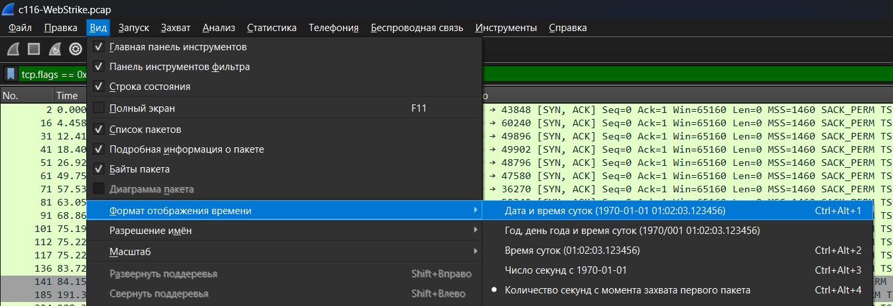

# 1. Wireshark operations

|Команда|Значение|Пример использования|
|---|---|---|
|==|равенство|ip.dst == 193.168.3.10|
|!=|Не равно|udp.dst != 53|
|<|меньше чем|ip.ttl < 24|
|>|больше чем|frame.len > 10|
|<=|меньше или равно|frame.len <= 0x20|
|>=|больше или равно|tcp.analysis.bytes_in_flight >= 1000|
|matches|регулярные выражения|frame matches "[Pp][Aa][Ss][Ss]"|
|contains|содержит|dns.resp.name contains google|

# 2. Wireshark basic filters

Пример фильтрации по одному конкретному протоколу:

```
http
```

Примеры фильтрации по нескольким протоколам:

```
http || tcp
```

```
http && tcp
```

Пример фильтрации по IP-адресу (работает сразу относительно IP-адресов получателя и отправителя):

```
ip.addr == 192.168.20.10
```

Пример фильтрации по IP-адресу отправителя:

```
ip.src == 192.168.20.10
```

Пример фильтрации по IP-адресу получателя:

```
ip.dst == 192.168.20.10
```

Примеры фильтрации, когда необходимо исключить IP-адрес:

```
ip.src != 192.168.20.10
```

```
ip.dst != 192.168.20.10
```

Пример фильтрации по TCP-порту получателя или отправителя, а также для каждого в отдельности:

```
tcp.port == 80
```

```
tcp.srcport == 80
```

```
tcp.dstport == 80
```

Примеры фильтрации по номерам потоков:

```
tcp.stream == 0
```

```
upd.stream == 0
```

Примеры фильтрации по конкретному номеру порта источника/получателя:

```
tcp.dstport==80
```

```
tcp.srcport==80
```

# 3. Interesting Filters

Отслеживанием Nmap:

```
ip.flags.mf == 1
```

```
tcp && !(tcp.flags.syn || tcp.flags.ack || tcp.flags.rst)
```

Количес­тво откры­тых пор­тов на ата­куемой машине:

```
tcp.flags == 0x12
```

Отслеживание ключевых слов в трафике:

```
http contains "sqlmap"
```

# 4. Wireshark Settings

Установить дату/время:

```
Вид => Формат отображения времени => Дата и время суток
```



# 5. Links

1. https://www.wireshark.org/docs/man-pages/wireshark-filter.html
2. https://www.infosecmatter.com/detecting-network-attacks-with-wireshark/